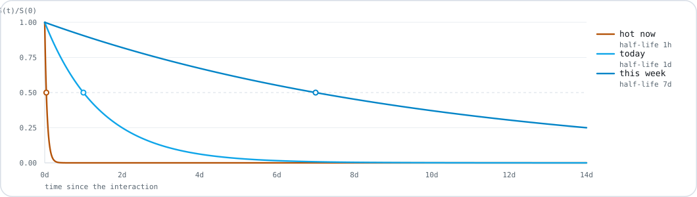
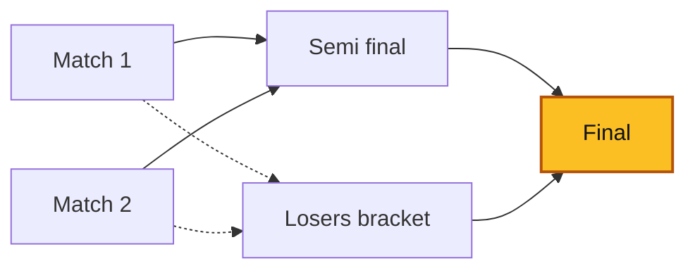

  <picture>
    <source media="(prefers-color-scheme: dark)" srcset="assets/banner.svg">
    
  </picture>

Three years in production, from backend architecture to continuous delivery. NestJS
and Node.js on the server, React and Next.js on the client, PostgreSQL underneath.
API security and secrets handling applied from the design phase, not bolted on after.
Antananarivo, Madagascar.

Three projects follow. Each had one thing it had to get right, and that thing is what
its section shows.

---

### cine-taste — a trending ranking that decays on its own, with no scheduled job anywhere in the codebase

A movie's score is the attention it has received, each interaction discounted by
how long ago it happened:

$$S(t) = \sum_i w_i\, e^{-\lambda (t - t_i)}, \qquad \lambda = \frac{\ln 2}{t_{1/2}}$$

Factor the constant out and what is left is an accumulator that only ever needs an
O(1) update — no rescan of history, ever. And since $e^{-\lambda t}$ is positive and
shared by every movie, it cannot change their order: sorting by the accumulator is
enough. That is why nothing has to run on a schedule. The ranking decays correctly
by construction.

The accumulator overflows a float64 quickly, so it is stored as $\log A$ and updated
with log-sum-exp, which keeps it finite for decades.

Three half-lives run in parallel, giving three views of the same journal:

  <picture>
    <source media="(prefers-color-scheme: dark)" srcset="assets/decay.svg">
    
  </picture>

Next.js 16 · Postgres · Drizzle &nbsp;·&nbsp;
[repo](https://github.com/SitrakaRasata/cine-taste) &nbsp;·&nbsp;
[live](https://cine-taste-sr.vercel.app)

### immo-grant — every access rule lives in the Postgres schema, and a delegated mandate expires without any row changing

The textbook case, "I can see what I own", proves nothing. The one worth building is
delegation: an agent holds a mandate on a listing they do not own, and it lapses on
its own. Every cell below is one named test.

|                      | SELECT | INSERT | UPDATE | DELETE |
|---|:--:|:--:|:--:|:--:|
| anonymous, published | yes | — | — | — |
| anonymous, draft     | —   | — | — | — |
| client               | yes | — | — | — |
| owning agent         | yes | yes | yes | yes |
| mandated agent       | yes | — | yes | — |
| unrelated agent      | —   | — | — | — |

The suite applies the production schema verbatim inside an in-process PostgreSQL.
No container, no external service, no server to start.

Three traps it walks into on purpose: policy recursion between two tables, which
needs a `SECURITY DEFINER` function to break; the discipline that function then owes,
since it is an RLS bypass; and the fact that `GRANT` is not RLS — a mandated agent may
edit a listing but must not reassign it, which `WITH CHECK` cannot express because it
only ever sees the row as it will be, never as it was.

SvelteKit · Supabase · PGlite &nbsp;·&nbsp;
[repo](https://github.com/SitrakaRasata/immo-grant) &nbsp;·&nbsp;
[live](https://immo-grant.vercel.app)

### tournament-engine — a format is a pure function returning a graph, so no `if (format === …)` exists anywhere else

A format takes its entrants and returns the matches to play plus the edges saying
where each winner *and each loser* goes next. Nothing else.

Solid edges carry the winner, dashed ones the loser. Everything downstream reads that
graph and knows nothing about brackets: propagating a result, cascading a correction
through every match it invalidates, computing live title odds, deciding the tournament
is over. Adding a format is one file and one registry entry.

The odds are exact on edge formats — one dynamic-programming pass over the DAG, each
pairing weighted by the Elo expected score, no sampling error. Round robin has no
edges, so outcomes are enumerated exactly while few enough remain and sampled beyond
that. Both are covered by property tests asserting the probabilities sum to one and
stay monotone in rating.

NestJS · React · SQLite &nbsp;·&nbsp; 249 tests &nbsp;·&nbsp;
[repo](https://github.com/SitrakaRasata/tournament-engine) &nbsp;·&nbsp;
no public demo — it runs from one Docker command

---

### Where I have worked

**Co-founder and full-stack developer — [NEXTRI](https://nextrimg.github.io)**
*Antananarivo · May 2026 – present*

A collective of three software engineers, hired as a team or as a single reinforcement.
Its technical lead. We designed an internal application from scratch, the three of us —
NestJS/TypeScript API, PostgreSQL schema, CI/CD pipeline, licensing — from design
through tests, with REST endpoints secured and secrets handled from the design phase.
It is an internal tool: not deployed, no users.

**Full-stack application developer — Stellar-IX (Axian Group)**
*Antananarivo · September 2022 – January 2025*

Cut a VMware monitoring application's average data load from 4s to 300–500ms by
rewriting its backend in FastAPI — vSphere REST for routine operations, pyVmomi where
the SOAP SDK was required — with caching and ClickHouse query optimisation.

Shipped more than ten full-stack modules to production with Docker CI/CD and
systematic code review, after getting TypeScript accepted for every new module on a
codebase that ran on legacy ejs and Node. That argument took several team discussions,
and it is the reason the title above says TypeScript. Contributed to the team's
technical decisions — architecture, data patterns, code quality — in a
ten-person multidisciplinary team working Agile.

**Mobile developer, internship — Ingenosya Madagascar**
*Antananarivo · August 2021 – February 2022*

Built the entire backoffice of an audio-visual e-learning platform, from scratch, for
a European client, in a team of eight. Followed it from design to delivery: client
meetings, then successive releases to staging, pre-production and production.

### Education and training

**Master MIAGE** — Mobiquity, Databases and Systems Integration (MBDS).
Université Côte d'Azur & IT University, Antananarivo · 2022 – 2025.
**Bachelor in computer science**, Web and Design. IT University, Antananarivo · 2018 – 2022.

**DevSecOps Professional** — Practical DevSecOps, January 2024. A three-day
instructor-led course with no examination, so: a course, not a certification.

### The stack

**Main** — TypeScript · React · NestJS · PostgreSQL
**Backend beyond it** — Node.js with Express · Java with Spring Boot · Python with FastAPI and Flask
**Frontend** — React · Next.js · Angular
**Data** — PostgreSQL · MySQL · MongoDB · ClickHouse
**API and security** — REST design · endpoint hardening · secrets handling · DevSecOps
**DevOps** — Docker · CI/CD · Git
**Architecture and quality** — system design · clean code · refactoring · code review · tests
**AI-assisted development** — Claude Code, for code, tests and documentation

---

  <picture>
    <source media="(prefers-color-scheme: dark)" srcset="https://raw.githubusercontent.com/SitrakaRasata/SitrakaRasata/metrics/latency.svg">
    
  </picture>

Both demos are probed every six hours from GitHub's runners, five requests each, and
the figure above is the median — a measurement, not a claim. A failed probe breaks the
line rather than being drawn as a fast response.
[The workflow](.github/workflows/metrics.yml) rewrites a single-commit `metrics`
branch each time, so no machine noise ever reaches this history.

---

[LinkedIn](https://linkedin.com/in/sitraka-rasata) &nbsp;·&nbsp; rasatasitraka2@gmail.com

*Malagasy (native) · French (fluent) · English (intermediate to professional, written)*
