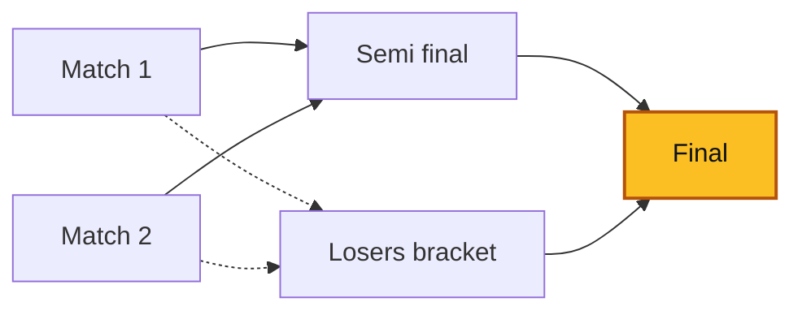

  <picture>
    <source media="(prefers-color-scheme: dark)" srcset="assets/banner.svg">
    
  </picture>

Three years building and shipping backend and frontend systems in production,
from architecture to continuous delivery. Based in Antananarivo, Madagascar.

## What I work with

NestJS and Node.js on the server, React and Next.js on the client, PostgreSQL as
the backbone. API security and secrets handling built in from the design phase.
AI-assisted development every day (Claude Code).

## Selected work

- **Cut a VMware monitoring app's data load from ~4s to 300–500ms** by rewriting
  its backend in FastAPI — vSphere REST for routine operations, pyVmomi for the
  advanced SOAP SDK — with caching and ClickHouse query optimization.
  *Stellar-IX (Axian Group)*
- **Shipped 10+ full-stack modules to production** with Docker CI/CD and
  systematic code reviews; brought TypeScript to new modules on a legacy ejs/Node
  codebase. Team of 10, Agile.
- **Built the full backoffice of an e-learning platform** for a European client,
  in a team of 8. *Internship — Ingenosya*
- **Co-founding [NEXTRI](https://nextrimg.github.io/nextri_portfolio/)**, a
  three-engineer collective — designing an internal application end to end
  (NestJS/TypeScript API, PostgreSQL schema, CI/CD, licensing), with a DevSecOps
  approach from the design phase.

## Tech

**Languages** &nbsp;

**Backend** &nbsp;

**Frontend** &nbsp;

**Data** &nbsp;

**Infra & quality** &nbsp;

&nbsp;·&nbsp; CI/CD · REST API design · DevSecOps · testing

**AI-assisted** &nbsp; Claude Code (code, tests, docs)

## Projects

Three of them. Each is here for one idea it had to get right.

### [cine-taste](https://github.com/SitrakaRasata/cine-taste) — a ranking that decays on its own

A movie's score is the attention it has received, each interaction discounted by
how long ago it happened:

$$S(t) = \sum_i w_i\, e^{-\lambda (t - t_i)}, \qquad \lambda = \frac{\ln 2}{t_{1/2}}$$

Factor the constant out and what is left is an accumulator that only ever needs an
O(1) update. And since $e^{-\lambda t}$ is positive and shared by every movie, it
cannot change their order — sorting by the accumulator is enough. There is no
scheduled job anywhere in the codebase, because the ranking decays correctly on
its own.

Next.js 16 · Postgres · Drizzle &nbsp;·&nbsp; [live demo](https://cine-taste-sr.vercel.app)

### [immo-grant](https://github.com/SitrakaRasata/immo-grant) — authorization that lives in the schema

Every access rule is a Postgres policy; none of it is reimplemented in the
application. The interesting case is not "I can see what I own" but delegation:
an agent holds a mandate on a listing they do not own, and it expires on its own,
without any row changing.

|                      | SELECT | INSERT | UPDATE | DELETE |
|---|:--:|:--:|:--:|:--:|
| anonymous, published | yes | — | — | — |
| anonymous, draft     | —   | — | — | — |
| client               | yes | — | — | — |
| owning agent         | yes | yes | yes | yes |
| mandated agent       | yes | — | yes | — |
| unrelated agent      | —   | — | — | — |

Every cell above is one named test, run against the production schema applied
verbatim inside an in-process PostgreSQL. No container, no external service.

SvelteKit · Supabase · PGlite &nbsp;·&nbsp; [live demo](https://immo-grant.vercel.app)

### [tournament-engine](https://github.com/SitrakaRasata/tournament-engine) — a format is a graph

A format is a pure function of its entrants. It returns the matches to play and
the edges saying where each winner *and each loser* goes next, and nothing else:

Solid edges carry the winner, dashed ones the loser. Everything downstream reads
that graph and knows nothing about brackets: propagating a result, cascading a
correction, computing live title odds, deciding the tournament is over. Adding a
format is one file and one registry entry.

NestJS · React · SQLite &nbsp;·&nbsp; 249 tests, no public demo — it runs from one Docker command

## Also

DevSecOps Professional — course completion, Practical DevSecOps (Jan 2024).
Currently deepening system design and high-performance data processing.

## Contact

[LinkedIn](https://linkedin.com/in/sitraka-rasata) &nbsp;·&nbsp; rasatasitraka2@gmail.com

*Malagasy (native) · French (fluent) · English (professional, written)*

 

